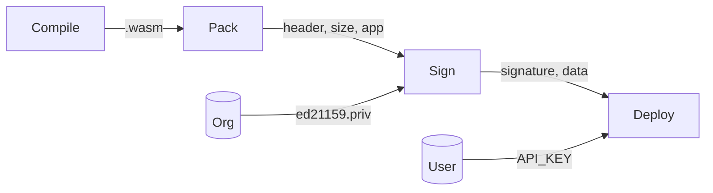

## Workflow



## Usage:

The following command will deploy an _xtblish app_ to the group 123.

```bash
xtblish deploy --source app/index.ts --config .xtblish.json --group 123
```

## Features

* Encrypted deployment (HTTPS)
* Signed application deployment (ed21159)
