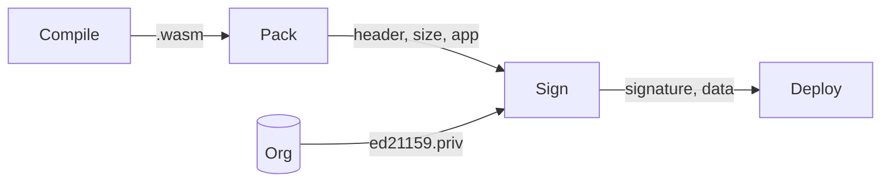

## Workflow


```mermaid
flowchart LR
    Compile --> |.wasm|Pack --> |header, size, app|Sign --> |signature, data|Deploy
    A@{ shape: cyl, label: "Org" } --> |ed21159.priv|Sign
```

## Usage:

The following command will deploy an _xtblish app_ to the group 123.

```bash
xtblish deploy --source app/index.ts --config app/xtblish.json --group 123
```
